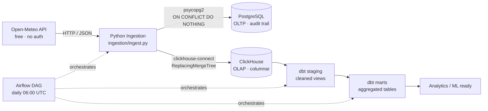

# Weather Data Pipeline

> End-to-end analytics pipeline: **Open-Meteo API → PostgreSQL → ClickHouse → dbt → Airflow**
> Deployed entirely with Docker Compose. One command to run everything.

---

## Architecture



**Layer responsibilities:**

| Layer | Technology | Purpose |
|-------|-----------|---------|
| Ingestion | Python + requests | Fetch 30-day hourly window per city; idempotent upsert |
| OLTP store | PostgreSQL | Row-oriented audit trail; source-of-truth for reprocessing |
| OLAP store | ClickHouse | Columnar engine for fast aggregations; `ReplacingMergeTree` for dedup |
| Transformation | dbt (staging → marts) | Typed views, business logic, data contracts, lineage |
| Orchestration | Apache Airflow | DAG with retries, dependency chain, daily schedule |
| Infrastructure | Docker Compose | Reproducible single-host deployment |

---

## Data Source

| Detail | Value |
|--------|-------|
| API | Open-Meteo Forecast API |
| URL | `https://api.open-meteo.com/v1/forecast` |
| Authentication | None required |
| Cities tracked | Kigali · Nairobi · Kampala · Dar es Salaam · Lagos |
| Metrics | Temperature, humidity, precipitation, wind speed, WMO weather code |
| Cadence | Hourly — rolling 30-day window per run |

---

## Quick Start

### Prerequisites
- Docker ≥ 24.x and Docker Compose ≥ 2.x
- 4 GB RAM minimum
- Internet access (Open-Meteo API)

### 1 — Configure environment variables
```bash
make setup       # copies .env.example → .env
# then edit .env and set your passwords
```

### 2 — Start the full stack
```bash
make up          # builds images, starts all services, waits for init
```

### 3 — Trigger the pipeline
```bash
make trigger     # fires the weather_pipeline DAG via Airflow CLI
```

Or use the **Airflow UI** → [http://localhost:8080](http://localhost:8080) (admin / admin)

---

## Makefile Commands

```
make setup      Copy .env.example → .env (first-time only)
make up         Build and start all services
make down       Stop all services
make clean      Stop and delete all volumes (full reset)
make trigger    Trigger the weather_pipeline DAG
make logs       Tail Airflow scheduler logs
make validate   Query row counts at every layer
```

---

## Validating Data at Each Layer

Run `make validate` to check row counts across all layers, or query manually:

### PostgreSQL (raw ingestion)
```bash
docker compose exec postgres psql -U pipeline_user -d weather_db -c \
  "SELECT city, count(*) AS rows, min(recorded_at), max(recorded_at)
   FROM raw_weather GROUP BY city ORDER BY city;"
```

### ClickHouse (raw OLAP)
```bash
docker compose exec clickhouse-server clickhouse-client --query \
  "SELECT city, count() AS rows FROM weather_analytics.raw_weather GROUP BY city;"
```

### dbt staging view
```bash
docker compose exec clickhouse-server clickhouse-client --query \
  "SELECT city, weather_description, count() AS n
   FROM weather_analytics.stg_weather GROUP BY city, weather_description
   ORDER BY city, n DESC LIMIT 20;"
```

### dbt mart (analytics-ready)
```bash
docker compose exec clickhouse-server clickhouse-client --query \
  "SELECT city, record_date, avg_temp_c, total_precipitation_mm, dominant_weather
   FROM weather_analytics.marts_mart_daily_weather_summary
   ORDER BY city, record_date DESC LIMIT 10;"
```

---

## dbt Data Quality Tests

Tests run automatically as the final DAG task (`dbt_test`). To run manually:
```bash
docker compose exec airflow-webserver \
  bash -c "cd /opt/dbt_project && dbt test --profiles-dir ."
```

Tests defined:
- `not_null` on all key columns in staging and mart layers
- `accepted_values` on `weather_description` (prevents unknown WMO codes slipping through)
- `unique_combination_of_columns` on `(city, record_date)` in the daily mart
- **Source freshness** check — warns if `raw_weather` hasn't been loaded in 25 hours

---

## Design Decisions

### Why dual databases (PostgreSQL + ClickHouse)?
PostgreSQL handles the OLTP write path: its `ON CONFLICT DO NOTHING` upsert semantics guarantee idempotent ingestion, and the row-oriented store is a reliable audit trail that survives reprocessing. ClickHouse is purpose-built for OLAP — its columnar storage makes `GROUP BY` aggregations over millions of rows an order of magnitude faster than a row store.

### Why `ReplacingMergeTree` in ClickHouse?
ClickHouse's `MergeTree` family is append-only by design. `ReplacingMergeTree(ingested_at)` deduplicates rows with the same `ORDER BY` key `(city, recorded_at)` during background merges, keeping the latest version. This suits the re-run model where ingestion overlaps the previous 30-day window.

### Why dbt?
- **Data contracts** via `schema.yml` tests catch regressions before data reaches consumers.
- **Lineage** — `stg_weather` is a single source of truth; the mart builds on top, making the dependency explicit.
- **Incremental readiness** — staging is a `view`, marts are `table` materialised in ClickHouse. The next step (incremental model with `is_incremental()`) requires only a one-line config change.

### Why Airflow?
The DAG enforces the correct dependency order (`ingest → dbt deps → staging → marts → tests`) with built-in retries. The schedule (`0 6 * * *`) aligns with overnight data availability from the Open-Meteo rolling window.

---

## Scaling Considerations

| Concern | Current state | How to scale |
|---------|---------------|--------------|
| More cities | Add to `CITIES` list in `ingest.py` | No schema changes needed |
| Historical backfill | 30-day rolling window | Parameterise `START_DATE` via Airflow Variables |
| Volume | Single-node ClickHouse | Add ClickHouse sharding/replication (`Distributed` engine) |
| Real-time | Batch (daily) | Replace ingestion with Kafka + ClickHouse Kafka engine |
| ML features | `mart_daily_weather_summary` has heat index, dominant weather | Directly usable as a feature store input |

---

## Stopping the Stack

```bash
make down        # stop containers
make clean       # stop + delete volumes (full reset)
```
